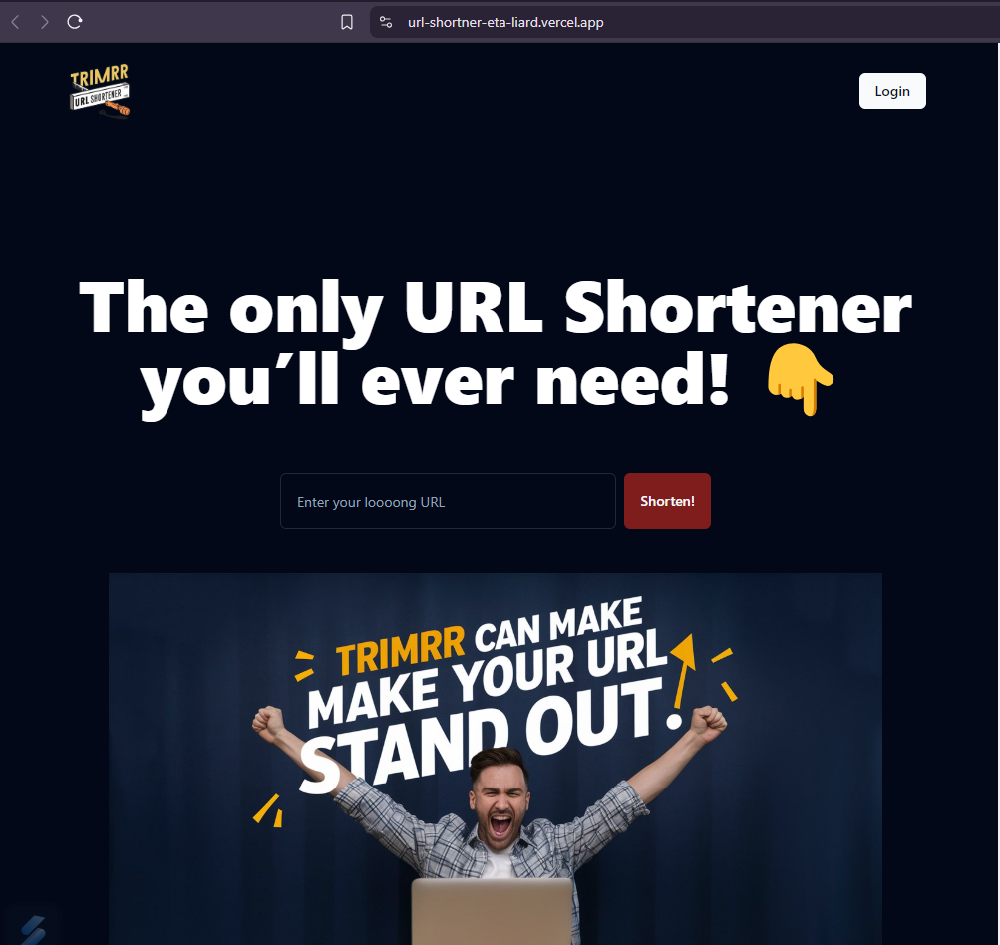
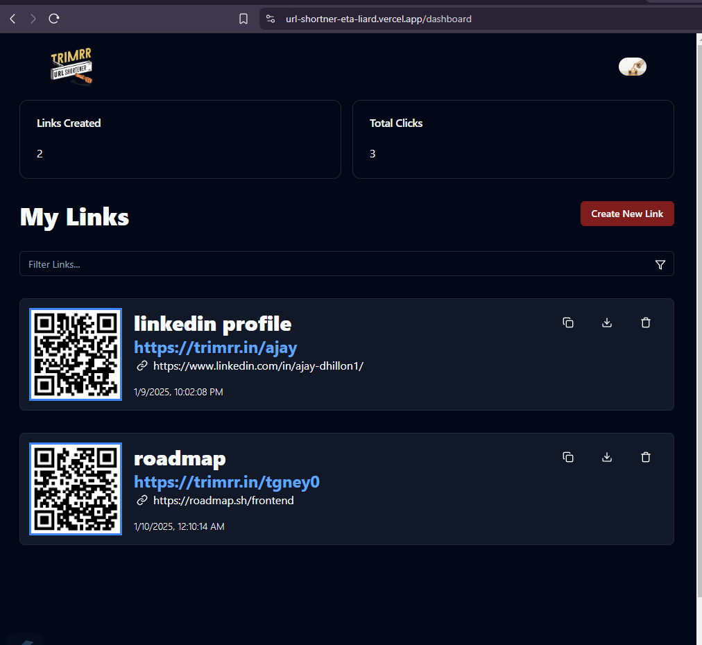
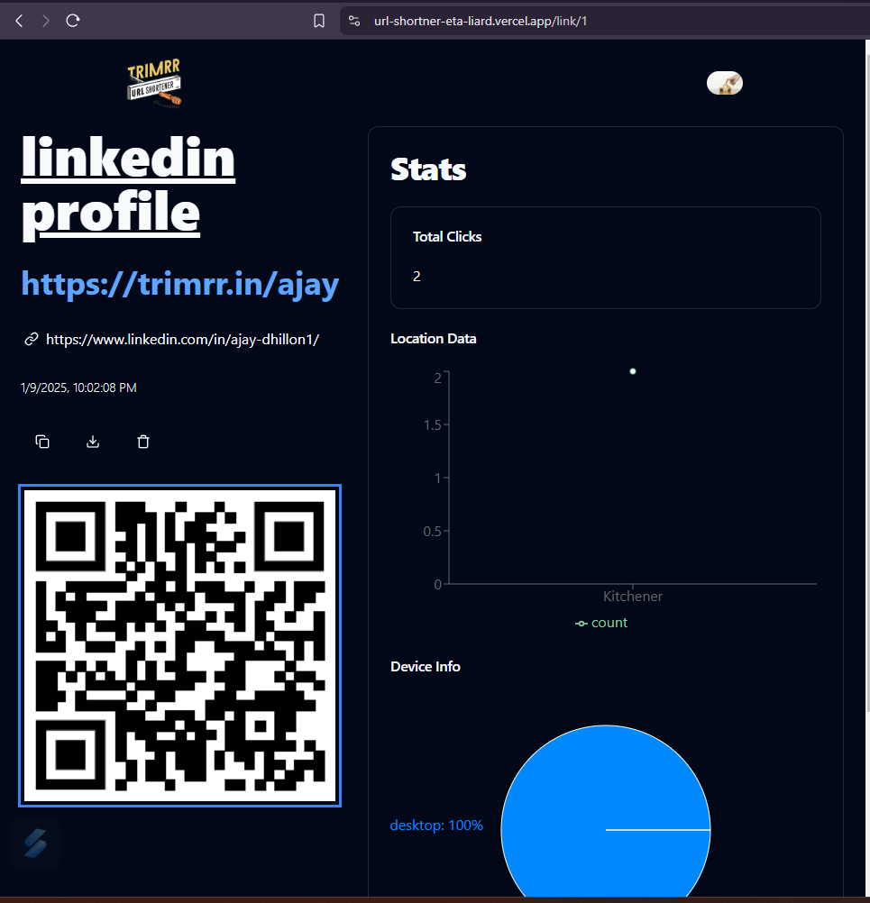

# Trimrr - URL Shortener

A full-stack URL shortener application built with React.js, Node.js, and Supabase. The app supports user authentication, URL shortening, analytics tracking, QR code generation, and a responsive UI.

---

## 🖥️ Live Demo
[Visit the live demo](https://url-shortner-eta-liard.vercel.app/)

---

## 🚀 Features
-URL Shortening: Shorten long URLs for easier sharing.
-User Authentication: Secure sign-up and login system.
-Analytics Tracking: Track clicks, locations, and devices.
-QR Code Generation: Generate downloadable QR codes for shortened URLs.
-Responsive Design: Built with ShadCN UI for an intuitive and modern user interface.
-Storage Integration: Upload profile pictures using Supabase storage buckets.
- ---

## Screenshots

### Landing Page
  
*This is the landing page of the application.*

### Dashboard
  
*Manage your links and analyze performance in the dashboard.*

### Analytics View
  
*View detailed analytics, including location, device, and click data.*


## 🛠️ Tech Stack
- **Frontend**: React.js, ShadCN UI, Tailwind CSS
- **Backend**: Supabase (Database and Auth)
- **Other Tools**: React Router DOM, Context API for state management
- **Deployment**: Vercel

---

## 🏗️ Installation and Setup

Follow these steps to run the project locally:

### Prerequisites
- Node.js installed (v16+ recommended)
- NPM 

### Steps
1. Clone the repository:
   ```bash
   git clone https://github.com/your-username/url-shortener.git
   cd url-shortener
2. Install dependencies:
  ```bash
      npm install;
```
3. Add environment variables in .env:
  VITE_SUPABASE_URL=your-supabase-url
  VITE_SUPABASE_ANON_KEY=your-supabase-anon-key
4. npm run dev

